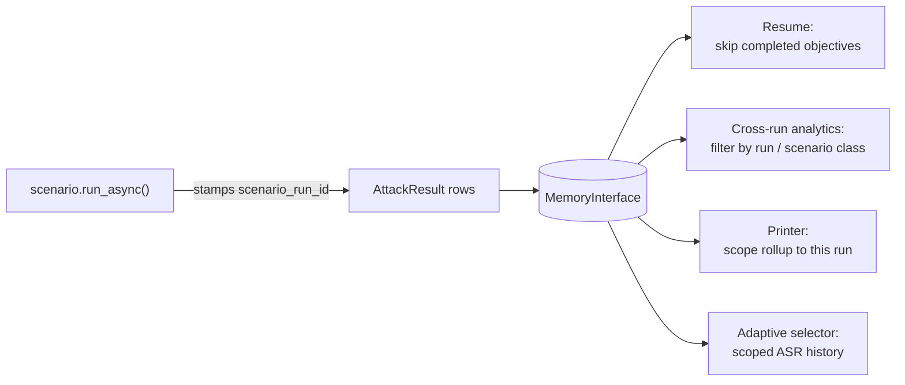

# Scenarios: Where We Started, and Where We're Going

<small>4 Jun 2026 - Hannah Westra</small>

When we first introduced scenarios in PyRIT a few releases back, the pitch was pretty simple: most of the operators we talked to were assembling the same set of pieces — a target, a curated dataset of objectives, a few attack strategies, a scorer — and running them in a loop. The framework gave them all the right Lego bricks, but every team was clicking those bricks together by hand. There was no clean unit of work to point at when you wanted to say, "run this exact configuration, then compare it against that one."

Enter scenarios. A scenario is a **pre-packaged red-teaming playbook** — a single object that bundles a curated set of objectives, a set of attack techniques to try against them, and the scoring + reporting logic to make sense of the results. You can run a scenario two ways: instantiate it in a notebook and `await scenario.run_async()` directly through the framework, or invoke it from the scanner CLI with `pyrit_scan` (or `pyrit_shell` for interactive exploration). Either way you get back a `ScenarioResult` you can save, share, and diff. The first batch — `RedTeamAgent` (originally `FoundryScenario`), `Encoding`, and a starter `ContentHarms` — shipped around v0.10.0 / v0.11.0.

We haven't really paused to write about scenarios on the blog since then, even though a *lot* has changed. This post is the catch-up: what scenarios look like today, what got sharpened in v0.13.0 and v0.14.0, and the new adaptive scenarios that landed in v0.14.0.

## What's in a scenario

Cracking one open, every scenario bundles five things:

- **Techniques — the *how*.** How are we going to attack? Maybe we just send the prompt directly. Maybe we wrap it in a role-play scenario. Maybe we escalate over multiple turns with Crescendo or TAP. Techniques include the attack strategy plus its converters, jailbreak templates, and adversarial-chat configuration — basically all the knobs that affect how the attack is crafted and delivered.
- **Datasets — the *what*.** What harmful content are we testing for? Hate speech, violence, fairness, leakage, scam content. Each scenario ships with curated datasets that match its scope.
- **Strategies — the runtime knob.** Each scenario exposes a named set of strategies (e.g. `default`, `single_turn`, `multi_turn`, `light`) that pick which techniques actually run on this invocation. `--strategies default` is how an operator says "just the quick subset"; `--strategies multi_turn` is how they say "give me the harder ones." Strategies are built dynamically from the technique registry per-scenario, so adding a new tagged technique just shows up under the right strategies automatically — no scenario edit needed.
- **Scoring and reporting.** Every response flows through scoring, and the printer rolls everything up into a readable summary.
- **Memory persistence.** Every prompt, response, and result gets persisted so you can come back later, compare runs, or pick up where you left off.

Scenarios can also opt in to running a **baseline pass** — sending the raw, unmodified prompts as a control group so the report can show "what the model does without any attack" next to "what the model does once attacked." Baseline behavior is generic to the `Scenario` base class (toggled per run via `include_baseline` and governed by `BASELINE_ATTACK_POLICY`); individual scenarios just decide whether it makes sense for their workload.

The whole point is that you don't have to wire any of this up yourself. Pick a scenario, point it at a target, and the scenario handles the rest.

## The scenarios you can run today

There are five flavors in the catalog right now. You can also bring your own — the abstractions are designed to be subclassed.

<!-- TODO IMAGE: Run `pyrit_scan list-scenarios` and screenshot the output, which
     shows the full catalog (Foundry, Garak, Benchmark, AIRT, Adaptive) with
     descriptions. Save to doc/blog/2026_06_04_scan_list_scenarios.png and
     uncomment the line below.

-->

**Foundry — `RedTeamAgent`.** The integration with [Azure AI Foundry's red-teaming library](https://learn.microsoft.com/en-us/azure/ai-foundry/responsible-ai/openai/red-team-tools). Organized by complexity (easy / moderate / difficult) rather than harm type. Easy = converters like Base64, ROT13. Difficult = multi-turn attacks like TAP and Crescendo. Built on HarmBench with 25+ techniques. The "throw everything at the wall" approach.

**Garak — `Encoding`.** Inspired by the [Garak](https://github.com/leondz/garak) project. Very focused: can the model be tricked into decoding and repeating harmful content? Tests 17 encoding schemes (Base64, Braille, Morse, Leet Speak, …) against slur terms and XSS payloads. Single-turn only, with a custom `DecodingScorer`. Niche but important for encoding-bypass vulnerabilities.

**Benchmark — `AdversarialBenchmark`** *(new in v0.14)***.** Not about testing a target — about comparing adversarial models. Feed it multiple red-teaming models and it measures which is most effective at generating attacks. No baseline run. Useful for "which adversarial model should we use?"

**AIRT — seven scenarios** built by the AI Red Team for real-world harm testing, each focused on one domain:

- `Jailbreak` — jailbreak templates (skeleton key, role-play, many-shot)
- `Cyber` — malware generation
- `Leakage` — PII, training-data, IP leaks
- `Psychosocial` — mental-health crisis, fake-therapist scenarios
- `Scam` — phishing and fraud generation
- `ContentHarms` — general-purpose; covers hate, violence, fairness, sexual content
- `RapidResponse` *(new in v0.14)* — broad starter scan; gets its own paragraph below

**Adaptive — `TextAdaptive`** *(new in v0.14)***.** A new family of scenarios that pick techniques on the fly based on what's worked before. Big enough to get its own section [below](#adaptive-scenarios-v0140).

### A closer look: `RapidResponse`

`RapidResponse` is the broadest of the AIRT scenarios — a comprehensive sweep across the most common techniques and the full AIRT harm-category catalog. It's a natural jumping-off point: you run it to get a wide, shallow read on which categories the target handles well and which ones come back concerning, then pivot to the more focused AIRT scenarios (or to `TextAdaptive`) to dig into whatever came back interesting.

The technique side pulls from seven core techniques (`prompt_sending`, `role_play`, `many_shot`, `TAP`, `crescendo_simulated`, `red_teaming`, `context_compliance`). The dataset side covers seven AIRT datasets (`airt_hate`, `airt_fairness`, `airt_violence`, `airt_sexual`, `airt_harassment`, `airt_misinformation`, `airt_leakage`). By default it sends four prompts per dataset, configurable with `--max-dataset-size`.

Like other scenarios it can run a baseline pass first (`include_baseline=True`, the default) — the raw prompts with no converters or wrapping techniques — so the report has a control group sitting next to the attacked numbers. Then it runs every selected technique against every selected dataset, in parallel, through the execution engine. The thing that's specific to `RapidResponse` is the *grouping*: results roll up by harm category rather than by technique, because when leadership asks "are we exposed to hate speech?", you want the answer organized that way.

Its strategy tags are worth knowing about: `default` is `prompt_sending + many_shot` (quick check), `single_turn` and `multi_turn` carve out the obvious subsets, and `light` is a fast sweep across five mostly-cheap techniques. So `pyrit_scan airt.rapid_response --target my_model --strategies default` gives you a quick two-technique pass across all seven harm categories; `--strategies multi_turn` hits the harder stuff.

<!-- TODO IMAGE: Run RapidResponse against a target end-to-end (e.g.
     `pyrit_scan airt.rapid_response --target my_model --strategies default`)
     and screenshot the final ConsoleScenarioResultPrinter summary. The ideal
     screenshot shows the baseline column next to the attacked columns and the
     per-harm-category breakdown sorted by success rate — that one image
     captures the RR output shape, the new sorted breakdown, and the
     harm-category grouping discussed in this section all at once. Save to
     doc/blog/2026_06_04_rapid_response_output.png and uncomment the line below.

-->

## What's improved in v0.13.0 and v0.14.0

A lot of the recent work has been less about building out our scenario library and more about making the underlying machinery sharper, so adding scenarios (and adding the *next* layer of capability on top of them) doesn't require rewriting the last one. Two new scenarios did join the catalog along the way — `RapidResponse` and `AdversarialBenchmark`, both in v0.14 — but the bulk of the work was under the hood.

**A real abstraction for "an attack you can drop into a scenario."** Before v0.13.0 a scenario glued attacks together by hand, knowing how to construct each one and what arguments it needed. `AttackTechnique` replaced that with a single bundle: the attack strategy class, the `seed_technique` configuration that tells the attack how to mutate prompts (jailbreak template, encoding, role-play wrapper, etc.), plus any technique-specific defaults like which adversarial chat to use. A scenario now composes a *list* of `AttackTechnique`s and hands them to the executor — the scenario doesn't need to know the internals of TAP versus Crescendo versus a converter-based attack, just that it has techniques to run. Standardized attack arguments shipped in the same release, which is what lets every technique constructor speak the same dialect.

**A catalog those techniques live in.** `AttackTechniqueRegistry` is where techniques register themselves with metadata: name, description, tags like `default` / `single_turn` / `multi_turn` / `light`, modality, what kinds of targets they work against. Scenarios pull techniques out via tag queries — `TagQuery.any_of("default")`, `TagQuery.all_of("multi_turn", "text")` — instead of importing each one by name. The scanner CLI uses the same registry to list and describe what's available. And to add your own, you write a factory and register it with a tag; every scenario that queries by that tag picks it up for free.

**Configuration from the CLI and from YAML.** v0.14 added a generic mechanism for setting scenario parameters at run time — both from `pyrit_scan` arguments (`--max-dataset-size 10 --strategies multi_turn`) and from YAML config files passed with `--config`. The same `set_params_from_args` plumbing is exposed in Python too, so a notebook user can stash their parameters in YAML and load the same config the CLI does. This is what made parameter-heavy scenarios like `TextAdaptive` (selector, epsilon, max attempts per objective, scope) feasible to drive from the CLI.

**Parallel execution within a scenario.** v0.14 reworked how atomic attacks fan out inside a single scenario run so independent objectives, techniques, and datasets actually run concurrently against the target (respecting the target's rate limits and the scenario's concurrency caps). For wide scenarios like `RapidResponse` — 7 techniques × 7 harm categories × N prompts — this is the difference between watching a progress bar for an hour and finishing in minutes.

**Attribution that survives runs.** Better Scenario Tracking added a scenario-run ID that gets stamped onto every `AttackResult` row the run produces. That sounds small but unlocks a lot:



When you resume a partially-completed scenario (via `scenario_result_id`), the framework can ask memory "which objectives already have results for *this* run?" and skip them without double-counting. Cross-run analytics like "how did `RedTeamAgent` do on this target across our last ten scans?" stop needing manual labeling. The printer can roll results up to the correct scenario invocation instead of mixing in unrelated history sitting in the same database. And this is what makes the adaptive selector's cross-run learning trustworthy — it can scope its history queries cleanly through `SelectorScope`.

**Sorted breakdowns and a new compound primitive.** Scenario printers now sort the per-group breakdown by success rate, so the categories the target is most vulnerable on float to the top of the report instead of being buried alphabetically. And `SequentialAttack` shipped as a compound `AttackStrategy`: give it a list of attacks and a `SequenceCompletionPolicy` (`FIRST_SUCCESS` stops as soon as one lands, `EXHAUSTIVE` runs them all, `FIRST_DECISIVE` stops on the first clear pass-or-fail), and it runs them in priority order. Adaptive scenarios use this under the hood, but it's available as a standalone building block any time you want "try the cheap thing first, escalate only if needed."

## Adaptive scenarios (v0.14.0)

`RapidResponse` is thorough — but it's brute force. It runs every technique against every objective, and most of those attempts are wasted. Maybe Crescendo works great on your target and `prompt_sending` never gets through. You're paying for the wasted ones anyway.

v0.14.0 ships a new family of scenarios — **adaptive scenarios** — that fix exactly this by leaning on the per-technique **attack success rate (ASR)** the framework already records in memory. Today it's just one: `TextAdaptive`. Image and audio variants are scaffolded by a modality-agnostic base and will follow once their technique pools are deep enough to be useful.

The idea is simple: instead of running every technique against every objective, the scenario **picks which technique to try next per-objective based on ASR, learns from what's worked, and stops as soon as one succeeds**. Budget goes from `O(techniques × objectives)` down to `O(max_attempts × objectives)`, where `max_attempts` defaults to 3.

Three pieces make it work:

- **The registry** — the same `AttackTechniqueRegistry` from v0.13.0. It's the catalog of available techniques the scenario can pick from.
- **The selector** — the brain. `EpsilonGreedyTechniqueSelector` decides what to try next using an explore/exploit tradeoff: most of the time it picks the technique with the best historical ASR; some of the time it tries something random to make sure it isn't missing a better option. New techniques get a fair shot before the selector settles on favorites.
- **The ASR feedback loop** — every attempt gets persisted to memory with a label identifying which technique ran. Next time the selector is asked to pick, it queries memory for those rows and ranks techniques by their track record.

The genuinely powerful part is that **it learns across runs**. The selector is stateless — it doesn't hold counts in memory, it queries `MemoryInterface` every time. If you ran `RapidResponse` last week and TAP worked 60% of the time, the adaptive scenario knows that on day one. It doesn't rediscover what you already learned. Every scan your org runs makes the next adaptive scan smarter. `SelectorScope` is the escape hatch when you want to narrow the scope — restrict to the current run, a specific scenario class, or a specific set of harm categories.

```python
from pyrit.scenario.scenarios.adaptive import (
    TextAdaptive,
    EpsilonGreedyTechniqueSelector,
)

scenario = TextAdaptive(
    selector=EpsilonGreedyTechniqueSelector(epsilon=0.3, random_seed=42),
)
scenario.set_params_from_args(args={"max_attempts_per_objective": 5})
await scenario.initialize_async(objective_target=target)
result = await scenario.run_async()
```

<!-- TODO IMAGE: Run the code block above (or cell 4/5 in
     doc/code/scenarios/3_adaptive_scenarios.ipynb) and screenshot the
     ConsoleScenarioResultPrinter output for TextAdaptive. The most valuable
     thing to capture is the per-objective trail of techniques the bandit
     picked (e.g. "tap -> crescendo_simulated [SUCCESS]" vs
     "role_play -> many_shot -> red_teaming [FAILURE]") plus the
     wins / picks / rate summary by technique near the bottom. That image
     makes the explore/exploit + ASR story land in a way the prose can't.
     Save to doc/blog/2026_06_04_text_adaptive_output.png and uncomment the
     line below.

-->

`prompt_sending` is intentionally excluded from the adaptive technique pool — since baseline is a generic scenario feature, `TextAdaptive` reuses it as the no-attack control (via `BASELINE_ATTACK_POLICY=Enabled`) so the report still shows the honest "no-attack" number alongside the adaptive results.

Bottom line: **`RapidResponse` tells you "here's how every technique did" against this target. `TextAdaptive` tells you "here's the fastest path to breaking this model."** Both are useful; you reach for them at different moments.

## Where to go next

- The scenarios docs landing page: [`doc/code/scenarios/`](../code/scenarios/0_scenarios.ipynb).
- The end-to-end walkthroughs from the scanner side: [`pyrit_scan`](../scanner/1_pyrit_scan.ipynb) and [`pyrit_shell`](../scanner/2_pyrit_shell.md).
- The [adaptive scenarios notebook](../code/scenarios/3_adaptive_scenarios.ipynb) is the fastest way to see the bandit in action against a real target.

A few things on the roadmap that are worth flagging:

- **Scenarios in the GUI.** Today scenarios run from the framework or the scanner. We're working on bringing scenario configuration and result browsing into the PyRIT GUI so non-CLI users can run scans, inspect results, and compare runs visually.
- **More adaptive modalities.** `ImageAdaptive` and `AudioAdaptive` are scaffolded but waiting on their attack-technique catalogs to be deep enough that there's something meaningful to adapt over.
- **Bring-your-own selectors and techniques.** `TechniqueSelector` is a small protocol with one method — building a contextual bandit, a Thompson sampler, or whatever else you want is a hundred-or-so lines. New techniques register into `AttackTechniqueRegistry` the same way the built-in ones do.

That's the catch-up. Thanks for reading!
